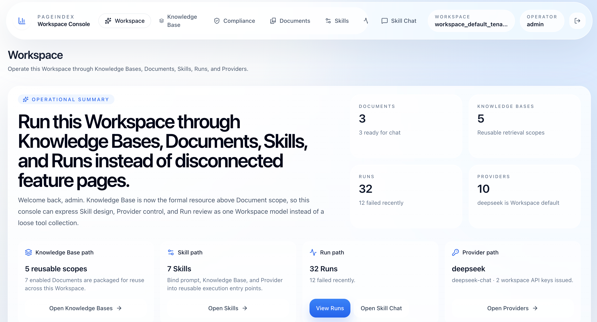
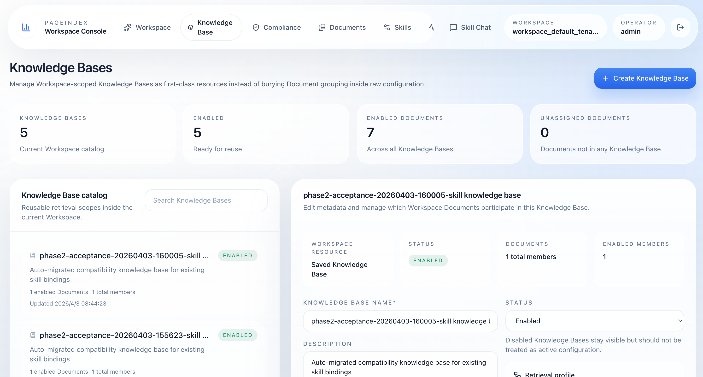
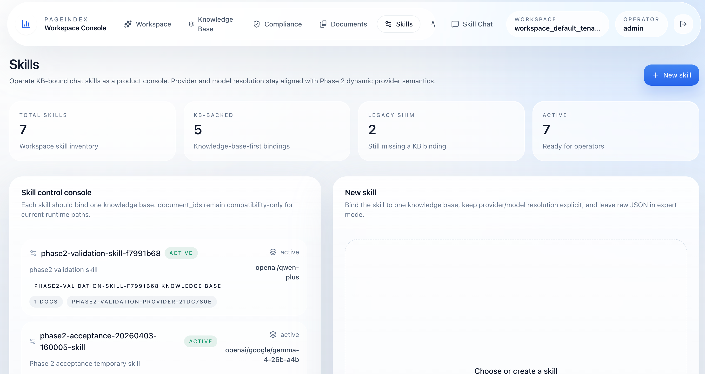
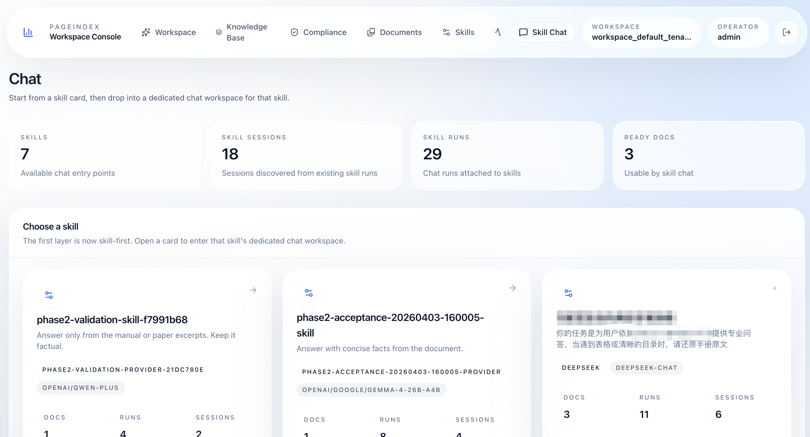

# PageIndex Service

`pageindex-service` is a service and console layer built on top of PageIndex. It packages the current Phase 3 FastAPI API, background worker, migrations, and React workspace console into an OSS-ready baseline for document ingest, knowledge-base management, skill chat, and compliance-style review flows.







This repository is based on and derived from [PageIndex](https://github.com/VectifyAI/PageIndex). It keeps the upstream [MIT license](/Users/shaoqing/workspace/PageIndex-main-integration/LICENSE) and does not claim to be the upstream PageIndex project itself. The role of this repo is the service surface around PageIndex capabilities.

Thanks to the PageIndex team for the upstream framework, open-source release, and the document-retrieval foundation this project builds on. This repository should be read as an implementation-oriented packaging of PageIndex into a more directly deployable service baseline, not as a replacement for the upstream project.

## Project Positioning

PageIndex Service exposes a workspace-aware service surface for:

- document ingest and parse jobs
- knowledge bases and document membership
- skill authoring and skill chat
- queue-backed chat execution with a worker
- compliance checks and compliance runs
- tenant/workspace-aware data model foundations

Current branch baseline:

- `main` is intended to carry the public Phase 3 baseline
- `codex/phase3-backend` remains the working branch for follow-up fixes
- this OSS packaging targets Phase 3 only and intentionally does not expand Phase 4 product scope

## Current Capabilities

Backend:

- FastAPI API under `app/`
- Alembic migrations under `migrations/`
- Redis-backed worker entrypoint in `app/worker.py`
- local or MinIO-backed artifact storage
- MySQL or SQLite-compatible SQLAlchemy runtime
- auth, providers, documents, jobs, knowledge bases, chat, compliance, and metrics routes

Frontend:

- React + Vite workspace console under `frontend/`
- workspace overview
- documents
- knowledge bases
- skills and skill chat
- compliance checks and compliance runs
- provider/control-plane views

## Architecture & Design Philosophy

### Component Architecture

- API: FastAPI app in [app/main.py](/Users/shaoqing/workspace/PageIndex-main-integration/app/main.py)
- Worker: Redis queue consumer in [app/worker.py](/Users/shaoqing/workspace/PageIndex-main-integration/app/worker.py)
- DB: SQLAlchemy models plus Alembic migrations in [migrations/](/Users/shaoqing/workspace/PageIndex-main-integration/migrations)
- Storage: local filesystem or MinIO via [app/services/storage_service.py](/Users/shaoqing/workspace/PageIndex-main-integration/app/services/storage_service.py)
- Frontend: React/Vite console in [frontend/](/Users/shaoqing/workspace/PageIndex-main-integration/frontend)

### Core Concepts & Isolation Model
PageIndex Service implements a strict, multi-layered isolation and execution model:

1. **Tenant & Workspace**: The foundational layer. A `Tenant` represents an organization, while `Workspace` provides isolated sandbox environments for resources. All knowledge, skills, and chat histories are strictly scoped to both `tenant_id` and `workspace_id`.
2. **Knowledge**: Answers *"Where do we retrieve semantic data?"* Defines a logical index across multiple documents and controls their retrieval profiles.
3. **Skills**: Answers *"How do we behave?"* Binds LLM configurations (prompts, model selection, parameters) with either explicit documents or a broader semantic Knowledge Base.
4. **Skills Chat**: Answers *"What is the context and status?"* Tracks persistent chat sessions and multi-turn message histories between users and skills.

### Asynchronous Execution (ChatRun State Machine)
Because generative retrieval (RAG) involves heavy I/O operations, inference tracking is queue-backed. Every turn of interaction generates a `ChatRun` with explicit state transitions:
- **Accepted**: Request safely ingested and queued to the Redis worker pool.
- **Running (Claimed)**: Picked up by a background worker, actively generating.
- **Completed**: Answer successfully generated, immediately writing back citations, selected sections, and resource metrics.
- **Failed / Cancelled**: Graceful failure tracking or safe interruption via user cancellation signals.

## Deployment Modes

PageIndex Service supports two deployment/runtime modes that map directly to the current code:

1. Full component mode
2. Minimal startup mode

Detailed Docker instructions live in [docker/README.md](/Users/shaoqing/workspace/PageIndex-main-integration/docker/README.md).

### 1. Full Component Mode

Recommended deployment mode:

- MySQL
- Redis
- MinIO
- API
- Worker

Use this mode for any production-style deployment.

Key settings:

- `APP_ENV=prod` or `APP_ENV=dev`
- `API_HOST`
- `API_PORT`
- `ADMIN_USERNAME`
- `ADMIN_PASSWORD`
- `SECRET_KEY`
- `DATABASE_URL=mysql+pymysql://<user>:<pass>@<mysql-host>:3306/pageindex`
- `TASK_QUEUE_BACKEND=redis`
- `REDIS_URL=redis://:<redis-password>@<redis-host>:6379/1`
- `STORAGE_BACKEND=minio`
- `MINIO_ENDPOINT=<minio-host>:9000`
- `MINIO_ACCESS_KEY=<access-key>`
- `MINIO_SECRET_KEY=<secret-key>`
- `MINIO_BUCKET=pageindex`
- `MINIO_PREFIX_PATH=`
- `MINIO_SECURE=false` or `true`
- `LLM_BASE_URL`
- `LLM_API_KEY`
- `CHAT_RUN_REQUEST_TIMEOUT_SECONDS`
- `CHAT_RUN_LEASE_TIMEOUT_SECONDS`
- `CHAT_RUN_QUEUE_RETRY_DELAY_MS`
- `CORS_ALLOW_ORIGINS`

Startup order:

1. Start MySQL, Redis, and MinIO.
2. Configure the environment file.
3. Execute `alembic upgrade head`.
4. Start the API.
5. Start the Worker.
6. Then access the frontend or API.

Compose entrypoint:

```bash
cd docker
cp .env.example .env
docker compose --profile full up -d --build
docker compose --profile full exec api alembic upgrade head
```

Important notes:

- `worker` only runs when `TASK_QUEUE_BACKEND=redis`
- production should prefer full mode
- `API_HOST=0.0.0.0` is only appropriate behind a reverse proxy / TLS boundary
- reverse-proxy upload limits must match `MAX_UPLOAD_BYTES`

Demo compose defaults intentionally use `pageindex_service123` for:

- MySQL root/user passwords
- Redis password
- MinIO access/secret
- `ADMIN_PASSWORD`

These defaults are only for:

- local demo
- test environments
- documentation examples

Production warning:

- replace every demo password
- generate a separate long random `SECRET_KEY`

### 2. Minimal Startup Mode

Use this mode when you want to validate the backend and UI locally without MySQL, Redis, or MinIO.

Minimal settings:

- `APP_ENV=dev`
- `API_HOST=127.0.0.1`
- `API_PORT=22223`
- `ADMIN_USERNAME=admin`
- `ADMIN_PASSWORD=pageindex_service123`
- `SECRET_KEY=pageindex_service123_local_dev_only_change_me`
- `DATABASE_URL=sqlite:///./data/app.db`
  Or in containerized local mode:
  `sqlite:////app/data/app.db`
- `STORAGE_BACKEND=local`
- `TASK_QUEUE_BACKEND=local`
- `REDIS_URL=` empty
- `MINIO_*=` empty
- `LLM_BASE_URL`
- `LLM_API_KEY`

Behavior:

- SQLite is used for the database
- files are written into `DATA_DIR`
- local filesystem storage replaces MinIO
- parse/chat do not require Redis worker mode
- no standalone worker process is needed
- good for development, self-test, and page/API integration
- not suitable for high concurrency or formal production use

Source startup:

```bash
cp .env.example .env
uv sync --python 3.12
uv run alembic upgrade head
uv run uvicorn app.main:app --host 127.0.0.1 --port 22223 --reload
```

Dockerized minimal mode:

```bash
cd docker
cp .env.example .env
docker compose --profile local up -d --build
docker compose --profile local exec api-local alembic upgrade head
```

If you need a non-`uv` fallback, [requirements.txt](/Users/shaoqing/workspace/PageIndex-main-integration/requirements.txt) still supports a manual `venv + pip install -r requirements.txt` path.

### Updating

Full mode update flow:

1. Pull new code or images.
2. Stop API and Worker.
3. Back up MySQL and object storage data.
4. Execute `alembic upgrade head`.
5. Start API.
6. Start Worker.
7. Check `/healthz`.
8. Validate KB, Skills, Chat, and Compliance pages.

Minimal mode update flow:

1. Stop API.
2. Back up the `data/` directory, including SQLite and local files.
3. Execute `alembic upgrade head`.
4. Restart API.
5. Validate `/healthz` and key pages.

## Environment Variables

Core:

- `APP_ENV`
- `API_HOST`
- `API_PORT`
- `DATA_DIR`
- `SECRET_KEY`
- `ADMIN_USERNAME`
- `ADMIN_PASSWORD`

Runtime services:

- `DATABASE_URL`
- `REDIS_URL`
- `TASK_QUEUE_BACKEND`
- `QUEUE_NAME_PARSE`
- `QUEUE_NAME_CHAT`
- `STORAGE_BACKEND`

Object storage:

- `MINIO_ENDPOINT`
- `MINIO_ACCESS_KEY`
- `MINIO_SECRET_KEY`
- `MINIO_BUCKET`
- `MINIO_PREFIX_PATH`
- `MINIO_SECURE`

LLM/provider bootstrap:

- `LLM_BASE_URL`
- `LLM_API_KEY`

Chat worker behavior:

- `CHAT_RUN_REQUEST_TIMEOUT_SECONDS`
- `CHAT_RUN_LEASE_TIMEOUT_SECONDS`
- `CHAT_RUN_POLL_INTERVAL_MS`
- `CHAT_RUN_QUEUE_RETRY_DELAY_MS`

Browser/runtime:

- `CORS_ALLOW_ORIGINS`
- `CORS_ALLOW_ORIGIN_REGEX`
- `MAX_UPLOAD_BYTES`
- `PROVIDER_URL_ALLOW_PRIVATE_NETS`

Use [docker/.env.example](/Users/shaoqing/workspace/PageIndex-main-integration/docker/.env.example) for Docker runtime examples and [.env.example](/Users/shaoqing/workspace/PageIndex-main-integration/.env.example) for minimal source startup.

## Upstream Relationship

- Based on / derived from PageIndex
- Keeps the upstream MIT license
- Explicitly credits and thanks the upstream PageIndex project
- Focuses on the service and console layer around PageIndex capabilities
- Does not rename the Python package tree aggressively; project-level naming is `PageIndex Service`

## Phase Status

This public baseline represents the current Phase 3 service productization state:

- tenant/workspace model foundation is present
- knowledge bases and compliance resources are present
- queue-backed chat worker plumbing is present
- README / Docker / env / runtime packaging have been tightened for OSS publication

Expected follow-up after this baseline:

- small fixes and closeout work
- additional runtime hardening
- no new Phase 4-scale feature expansion in this packaging pass

## Roadmap Direction

Near-term roadmap themes:

- improve deployability beyond single-host compose
- add Kubernetes-friendly deployment packaging
- keep the service surface compatible with alternative infrastructure components often used in domestic deployments
- evaluate substitutes for Redis, MySQL, and MinIO where equivalent runtime roles are needed
- workspace, user, and permission design work is in progress and is expected to land in `v0.2.0`

Repository rename and release guidance lives in [RELEASING.md](/Users/shaoqing/workspace/PageIndex-main-integration/RELEASING.md).

## Important Notes

- The frontend is a separate build from the API service. The root Dockerfiles package the backend API and worker, not a production frontend server.
- The recommended runtime baseline for source development is Python 3.12 plus `uv`.
- Do not expose raw uvicorn directly to the public internet without a reverse proxy, TLS termination, and explicit CORS configuration.
- Some Phase 3 semantics remain foundational rather than fully expanded product flows; the public repository focuses on runnable service packaging rather than shipping internal design docs.
