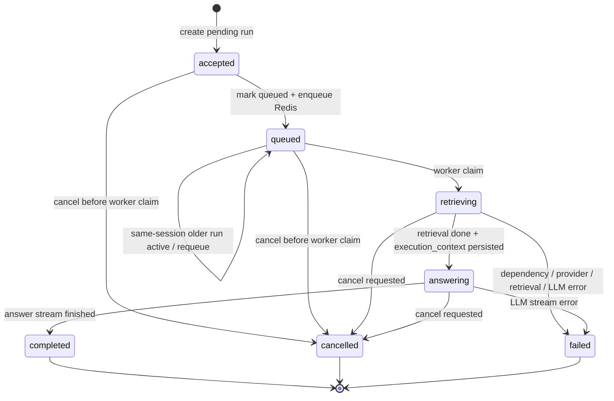
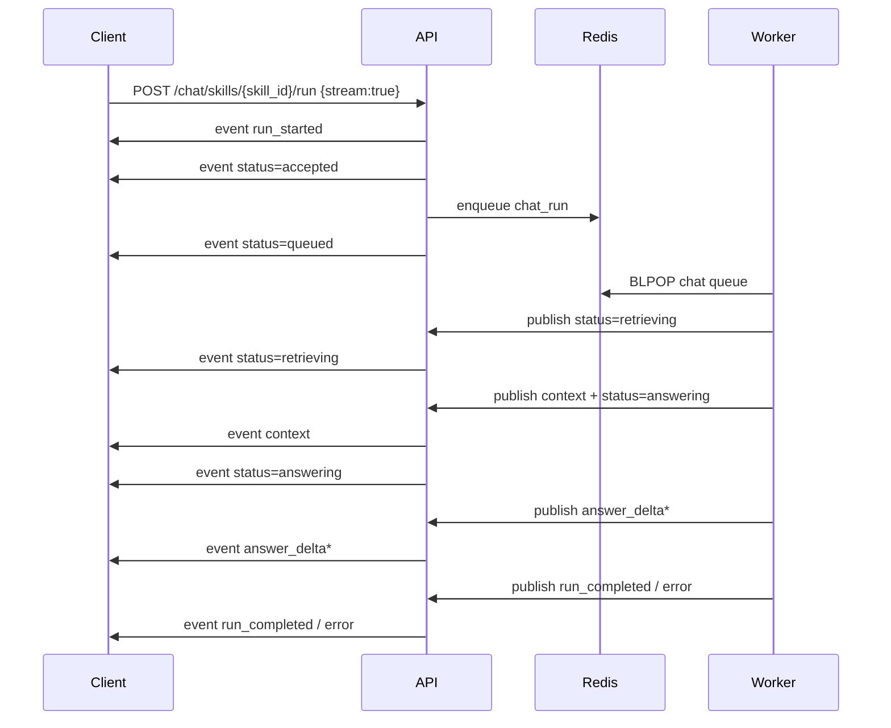

# Phase 4.9 临时阶段: skills run -> worker 状态机与慢点分析

本文档只描述当前代码里的真实运行面，不沿用旧 spec 的理想态。

## 结论先看

- `POST /api/v1/chat/skills/{skill_id}/run` 当前是 `API 同步等待 + Redis worker 异步执行` 的组合。
- `skills run` 当前真实执行模型是单本，不是真正的多本 federated 检索。
- 当前并没有在生产代码里使用 `hybrid tree search / value-function MCTS`。
- worker 进程本身是单循环串行消费；并发主要依赖 worker 副本数，而不是单进程内并行。

## 当前真实代码入口

- 路由入口: `/Users/shaoqing/workspace/PageIndex/app/api/routers/chat.py`
- 运行主干: `/Users/shaoqing/workspace/PageIndex/app/services/chat_service.py`
- 队列封装: `/Users/shaoqing/workspace/PageIndex/app/services/task_queue_service.py`
- worker 主循环: `/Users/shaoqing/workspace/PageIndex/app/worker.py`
- 选段逻辑: `/Users/shaoqing/workspace/PageIndex/app/services/pageindex_service.py`

## 状态机: 单本 skills run

### HTTP 非流式

### HTTP 流式 SSE

## skills run 的真实执行流程

### 1. 路由选文档

当前 `skills run` 不是多本文档聚合。

- 路由先读取 `skill.documents`
- 如果请求没显式传 `document_id`
- 直接取 `document_ids[0]`

也就是说:

- skill 绑定多个 document 时
- `skills/{skill_id}/run` 当前只跑第一本
- 所以 `manual_count` 现在固定为 `1`

## 多本现状

### skills run

- 当前不是多本
- 没有 KB federated merge
- 没有跨文档 top-k 汇总

### compliance run

真正的多本路径当前在 `/Users/shaoqing/workspace/PageIndex/app/services/compliance_service.py`:

- 先解析 knowledge base 下所有 manual
- 对每本 manual 串行执行 `choose_relevant_nodes`
- 汇总候选 section
- 做全局 citation merge
- 再进入最终 answer 阶段

当前 resolved mode:

- 单本: `single_manual`
- 多本: `multi_manual_federated`

但这套状态机不在 `skills run` 链路里。

## LLM 调用现状

当前 `skills run` 里可能发生的模型调用，不止一次:

1. 可选: `query_rewrite`
2. 可选: `query_rewrite_json_repair`
3. 常见: `outline_selection`
4. 可选: `outline_selection_json_repair`
5. 必选: `final_answer_stream`

如果上游偶发错误，`llm_completion()` 还会:

- 最多重试 `10` 次
- 每次失败后 sleep `1s`

所以看起来“慢”的时候，可能并不是单次调用慢，而是隐藏重试把时延拉长了。

## 为什么当前会慢

### 1. worker 单进程串行消费

`app/worker.py` 是一个 `while True + blpop` 循环。

- 一条消息出队
- 一次只处理一个 job
- 当前进程内没有并发池

因此:

- 一个慢 run 会阻塞同进程后面的 run
- 真正并发依赖多个 worker 副本

### 2. 同 session 串行化

`_claim_session_slot()` 会阻止同一个 session 内的后续 run 并行执行。

如果前一个 run 没完成:

- 当前 run claim 失败
- sleep `CHAT_RUN_QUEUE_RETRY_DELAY_MS`
- 重新入队

这会放大排队时间。

### 3. 一次查询不是一次模型调用

当前 run 的 retrieval 阶段本身就可能包含 2 到 4 次模型调用。

最终 answer 再来 1 次流式调用。

### 4. retrieval 后还有本地 PDF 上下文构造

选中 node 后，还会:

- 打开 PDF artifact
- 提取页文本
- 按 `max_context_pages / max_context_tokens` 组装上下文

这一步不是 LLM，但也会占时间。

### 5. 同步 HTTP 接口会一直等 worker 跑完

非流式 `POST /chat/skills/{skill_id}/run` 虽然底层进了队列，但 API 线程会继续 `wait_for_chat_run_terminal()`。

所以用户体感是:

- 发起一次接口
- 直到 worker 完成才返回

这会把排队时间和执行时间全部暴露成接口时延。

## hybrid tree search 现状

当前真实后端没有启用 hybrid tree search。

代码里真正使用的是:

- `outline_llm`
- `lexical_fallback`

`value-function MCTS / hybrid tree search` 只在 `examples/tutorials/tree-search/README.md` 里提到，属于文档表述，不是当前 runtime。

## Phase 4.9 这次补的观测点

本次代码改动后，worker 日志会额外输出:

- worker 出队时的 `queue` 与 `backlog_after_pop`
- run claim 成功时的 `queue_ms`
- provider/model 解析结果
- history 使用情况
- retrieval 起止与耗时
- 每个 LLM request 的:
  - `label`
  - `phase`
  - `attempt`
  - `duration_ms`
  - `prompt_chars`
  - prompt 预览
- 最终 `metrics`

另外，run metrics 现在额外带:

- `queue_ms`
- `wall_clock_ms`

## 下一步建议

如果 Phase 4.9 目标是先把“为什么慢”查清楚，建议先看三类数据:

1. `queue_ms` 是否高
2. `retrieval_ms` 是否高
3. `answer_ms` 是否高

分诊逻辑:

- `queue_ms` 高: 先查 worker 副本数、session 串行化、队列 backlog
- `retrieval_ms` 高: 先查 rewrite/outline selection/repair 调用次数和重试
- `answer_ms` 高: 先查最终模型响应速度、prompt 体积、上下文页数

如果后续要真正解并发问题，建议优先评估三件事:

1. `skills run` 是否要脱离“同 session 串行化”
2. worker 是否要从单循环改成可控并发消费
3. `skills run` 是否要补真实多本 federated 路径，而不是继续默认 `document_ids[0]`
