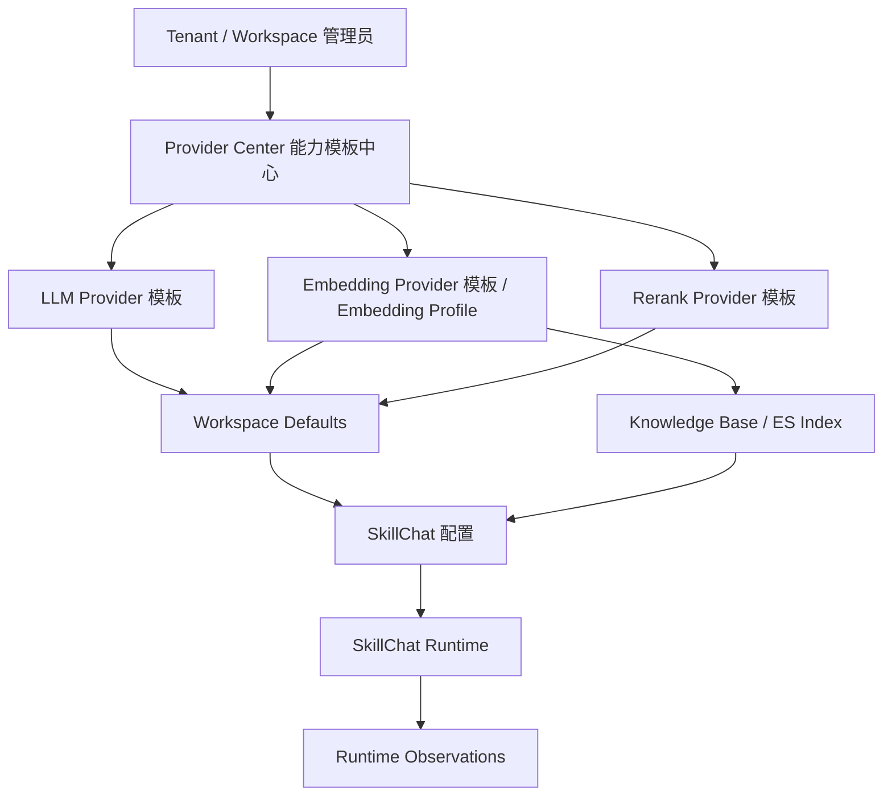
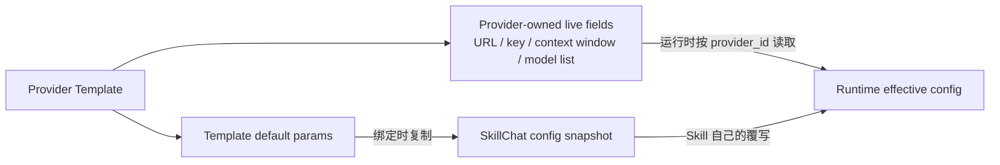

# 09 — Provider Center / SkillChat / Runtime Product Design

**状态**：草案，基于 2026-05-17 产品讨论
**目标读者**：用户、主控架构 AI、后续 Provider Center coding agent、后续 SkillChat coding agent、后续 runtime observation coding agent
**前置阅读**：`01_architecture_vision.md`、`02_current_state_analysis.md`、`06_migration_roadmap.md`、`08_coding_prompts/phase_5_0_1_monday_provider_runtime_delivery.md`

## 文档职责

定义 Provider Center、SkillChat 与 runtime observation 的产品边界和消费关系。本文档用于替代当前 `/providers` 大杂烩页面的产品方向，并为后续拆分 coding prompt 提供事实基础。

本文档不直接要求本轮实现 SkillChat 配置页和 runtime observation；这两块后续交给独立 agent。

## 核心结论

Provider Center 不是某个具体业务运行页，而是租户/工作区级的模型能力模板中心。

Provider Center 负责：

1. 配置系统内可用的大模型能力连接方式。
2. 配置模型能力默认参数。
3. 探测 provider 可用性与模型列表。
4. 管理 tenant / workspace / shared workspace 可见范围。
5. 给 SkillChat、Knowledge Base、Compliance 等消费者提供可绑定的能力模板。

SkillChat 是 provider 模板的消费者。SkillChat 绑定 provider 模板后，保存自己的运行参数快照；之后 SkillChat 的参数修改只影响该 skill，不反向修改 Provider Center 中的模板。

## 产品问题

当前 `/providers` 页面把以下职责混在一个画布里：

1. API key 管理。
2. provider library。
3. execution defaults。
4. provider 编辑表单。
5. chat / embedding / rerank endpoint 编辑。
6. draft probe 与 saved probe。

随着 provider 内容变多，这种工作台式页面会失去秩序。API key 与 provider 混放会让入口语义不清；chat / embedding / rerank 三能力挤在同一表单里也会让用户误以为它们必须作为同一个 provider profile 被维护。

新的产品方向是层次型 Provider Center。

## 一级页面

`/providers` 改为 Provider Center 首页，只放入口和摘要，不直接做复杂编辑。

首页四张卡片：

| 卡片 | 职责 | 进入页面 |
|---|---|---|
| API Keys | 创建、查看、撤销 workspace API key | `/providers/api-keys` |
| LLM Providers | 管理 chat / final answer 能力模板 | `/providers/llm` |
| Embedding Providers | 管理 embedding 能力模板与向量空间契约 | `/providers/embedding` |
| Rerank Providers | 管理 rerank 能力模板 | `/providers/rerank` |

未来图片生成、视频生成、语音等能力继续以卡片形式扩展，不再把所有能力塞进单页。

## 二级能力页面

每个二级页面只管理一种能力，主体采用表格，创建/编辑采用 modal 或 side panel。

通用表格字段：

1. Name。
2. Scope：tenant / workspace / shared。
3. Base URL：表格中显示 host + path，hover 或展开查看完整 URL。
4. Model：来自 provider 探测结果或手动输入。
5. Auth：能力页支持的 auth mode；当前已确认 LLM/chat 可表达 `No auth` 或 `API key`，embedding/rerank runtime 本阶段仍要求 API key。
6. Default：workspace default / tenant default。
7. Health：healthy / unhealthy / unknown。
8. Latency。
9. Last tested。
10. Actions：Test / Edit / Share / Set default / Delete。

不做 `Custom headers` auth mode。内网无密码 LLM/chat 资源用 `No auth` 显式表达；需要 API key 的资源用 `API key` 表达。Dify 或更复杂 header-based auth 以后单独设计，不进入本轮 Provider Center 基础产品形态。

2026-05-17 运行时收口决策：embedding / rerank 的 No auth runtime 支持关闭，不进入 Phase 5.0.3。当前 `OpenAICompatibleEmbeddingClient` 继续要求 api_key 非空；内网 rerank 不走 DashScope native rerank helper，因此不为该 helper 增加 No auth。

## 普通模式与开发者选项

普通模式只展示高频字段：

1. Name。
2. Scope / share。
3. Base URL。
4. Auth mode。
5. API key（仅 `API key` 模式展示，可为空保存为未配置）。
6. Model。
7. Test connection。
8. Set default。

开发者选项展开后展示能力细节和低频参数：

1. context window。
2. max output tokens。
3. temperature。
4. top_p。
5. top_k。
6. repetition / presence / frequency penalty。
7. embedding dimensions。
8. rerank top_n。
9. provider config JSON。

开发者选项中的参数必须有默认值，用户可以不配置。

## LLM Provider 模板

LLM Provider 模板代表 chat / final answer 能力。

Provider-owned 字段：

1. provider id。
2. name。
3. base_url。
4. auth mode：`No auth` 或 `API key`。
5. api key。
6. available model list。
7. default model。
8. context_window_tokens。

模板默认参数：

1. `temperature = 0.2`。
2. `context_window_tokens = 131072`。
3. `max_output_tokens = null`。
4. `top_p = null`。
5. `top_k = null`。

重要语义：

OpenAI 协议里的 `max_tokens` / `max_completion_tokens` 表示最大输出 token，不表示模型总上下文窗口。因此 Provider Center 中的模型总上下文窗口必须使用 `context_window_tokens` 表达，不能把 `max_tokens=131072` 默认塞进请求。

## Embedding Provider 模板

Embedding Provider 模板代表向量空间能力。它比 LLM 更依赖一致性，因为文档构建和查询必须落在同一个向量空间契约上。

当前 runtime 边界：embedding provider 仍要求 API key 鉴权，不支持 No auth runtime。Provider Center 后续如展示 auth mode，必须避免暗示 embedding 无 key 已可运行。

默认参数：

1. `context_window_tokens = 16384`。
2. `dimensions = 2048`。

当用户填写 `dimensions = 4096` 时，UI 需要提供问号 tooltip，提示 Elasticsearch 版本和索引 mapping 必须支持对应维度，尤其 ES 8 以上能力差异需要确认。

如果 probe 发现实际 embedding dimensions 与配置冲突，必须报错并提醒用户修改，不自动覆盖用户配置。

## Embedding Profile

Workspace 文档构建和 SkillChat 查询不应只按 provider 来源判断能否混用，而应按 Embedding Profile 判断。

Embedding Profile 是向量空间契约，建议包含：

1. canonical model key，例如 `qwen3-embedding-8b`。
2. dimensions。
3. context_window_tokens。
4. distance metric：cosine / dot_product / l2。
5. normalization strategy。
6. optional probe fingerprint。

如果两个 embedding provider 来自不同 endpoint，但 canonical model key、dimensions、distance metric、normalization strategy 一致，它们可以被视作同一个 Workspace Embedding Profile 的不同来源。

如果这些字段不一致，则不能混查已有 ES index。切换 profile 时必须提示需要重建向量索引。

## Rerank Provider 模板

Rerank Provider 模板代表重排能力。

当前 runtime 边界：rerank provider 不新增 No auth runtime 支持；DashScope native rerank helper 的鉴权语义不变。内网 rerank 若接入，应走后续统一 adapter 设计，不在 Phase 5.0.3 扩展。

默认参数：

1. `top_n = 512`。

Provider 模板声明 rerank 能力上限和默认值。SkillChat 可以覆盖实际使用的 top_n / top_k，但覆盖只保存在 SkillChat 自己的配置中。

## Provider / SkillChat 消费关系

SkillChat 必须绑定 LLM Provider。Embedding 不作为 SkillChat 页面中的任意自由配置项；SkillChat 选择 Knowledge Base 时应继承该 Workspace / Knowledge Base 的 embedding profile。Rerank 可以作为 SkillChat 的可选能力，默认从 workspace 或 tenant 可用模板中继承。

## SkillChat 继承与覆写

SkillChat 绑定 provider 模板时，会保存一份 skill-owned 运行参数快照。后续在 SkillChat 页面中修改这些参数，不会写回 Provider Center。

但不是所有字段都允许 SkillChat 修改。

Provider-owned live fields：

1. base_url。
2. api key / auth mode。
3. provider 支持的 context_window_tokens。
4. provider id。
5. available model list。

Skill-owned snapshot / overrides：

1. selected model：只能从 provider available model list 中选择，不能随便填写。
2. temperature。
3. top_p。
4. top_k。
5. max_output_tokens。
6. rerank top_n。
7. retrieval / context budget 等 skill 自己的业务参数。

Provider 后续更新 URL、key、context window 或 model list 时，SkillChat 不需要同步参数快照；运行时按 provider id 读取最新 provider-owned live fields。

如果 provider 被删除，SkillChat 引用失效，必须在 SkillChat 页面提示重新绑定能力模板。

不需要 provider template version。继承之后 SkillChat 如何修改参数，是 SkillChat 自己的事情。

## 模型探测

Provider 探测只关心模型名列表和连接可用性。

`/models` 成功时：

1. 缓存 available model list。
2. 创建/编辑 modal 中允许 dropdown 选择模型。
3. SkillChat 只能从这个 provider 的 model list 中选择模型。

`/models` 失败时：

1. 创建 provider 时允许手动填写模型名。
2. 表格中标明模型列表不可探测。
3. SkillChat 如果没有模型列表，只能使用 Provider Center 中保存的 default model。

不要求 probe 探测 temperature、context window、dimensions 等高级参数，这些由 Provider Center 模板配置承载。

## 后续实现拆分

### Agent A — Provider Center UI 重构

优先级最高，直接替换当前 `/providers` 页面。

范围：

1. `/providers` 改为四卡入口。
2. 新增 `/providers/api-keys`。
3. 新增 `/providers/llm`。
4. 新增 `/providers/embedding`。
5. 新增 `/providers/rerank`。
6. 每个能力页使用表格 + modal / side panel。
7. 支持 `No auth` / `API key`。
8. 支持 provider probe、model list cache、health status。
9. 支持普通模式 / 开发者选项。

禁止：

1. 不改 SkillChat 配置页。
2. 不改 runtime observation。
3. 不引入 model-gateway。
4. 不实现 Dify auth/header 复杂形态。

### Agent B — SkillChat 配置页重构

Provider Center UI 稳定后执行。

范围：

1. SkillChat 必选 LLM Provider。
2. SkillChat selected model 来自 provider model list。
3. SkillChat 保存 skill-owned 参数快照。
4. SkillChat 可覆盖 temperature、top_p、top_k、max_output_tokens、rerank top_n 等。
5. SkillChat 选择 Knowledge Base 时继承 Workspace / Knowledge Base embedding profile。
6. Provider 删除或不可用时提示 skill 配置失效。

禁止：

1. SkillChat 页面修改不得回写 Provider Center。
2. 不允许 SkillChat 随便填写 provider 不支持的模型名。

### Agent C — Runtime / Observation 对齐

SkillChat 配置页重构后执行。

范围：

1. 定义 effective runtime config。
2. runtime 合并 provider-owned live fields 与 skill-owned overrides。
3. observation 记录实际 LLM / embedding / rerank provider id、model、参数、latency、错误。
4. embedding / rerank 工作状态必须能在 SkillChat runtime 中观察。
5. Compliance 后续纳入同一 `ResolvedRuntimeEndpoint` / effective runtime boundary。

禁止：

1. 不让 Compliance 在本阶段私自复制 runtime resolver。
2. 不删除 legacy LiteLLM fallback，除非有独立迁移任务。

## 主控需要关注的决策变动

1. `/providers` 不再继续做单页大杂烩增强，而应直接替换成 Provider Center 四卡入口。
2. provider 从“三能力聚合 profile”产品视角，调整为“按能力管理的模板中心”产品视角。
3. SkillChat 是 provider 模板消费者，保存自己的运行参数快照；修改不回写 Provider。
4. Provider-owned live fields 与 Skill-owned snapshot fields 必须明确区分。
5. Embedding 需要引入 Embedding Profile / vector space contract，不能只按 endpoint 来源判断一致性。
6. Auth mode 只做 `No auth` / `API key`，不做 `Custom headers`。
7. `context_window_tokens` 与 OpenAI 请求里的 `max_tokens` 必须分开。
8. SkillChat 配置页和 runtime observation 是后续独立 agent 任务，不应混入 Provider Center UI 重构。
